# System Architecture

This document provides a detailed technical overview of the Secure Vote-Transfer System architecture.

## High-Level Architecture

The system follows a three-tier architecture:

1. **Presentation Layer** - Web interfaces (HTML/CSS/JavaScript)
2. **Application Layer** - Python Flask servers
3. **Data Layer** - C++ blockchain core with persistent storage


## Component Details

### 1. Voting Booth (Presentation Layer)

**Location**: `web/voting_booth/index.html`

**Purpose**: Provides a clean, user-friendly interface for voters to cast their ballots.

**Features**:
- Voter ID input
- Candidate selection dropdown
- Real-time feedback on vote submission
- Auto-increment voter ID for testing
- Error handling for duplicate votes

**Technology**: Pure HTML/CSS/JavaScript with Fetch API

### 2. Admin Dashboard (Presentation Layer)

**Location**: `web/dashboard/dashboard.html`

**Purpose**: Real-time monitoring interface for system administrators.

**Features**:
- Live blockchain shard visualization
- Vote distribution across shards
- Total vote count
- Candidate tally breakdown
- Auto-refresh every 2 seconds

**Technology**: HTML/CSS/JavaScript with polling mechanism

### 3. Voting Node (Application Layer)

**Location**: `server/voting_node/app.py`

**Purpose**: Main backend server handling vote submissions and system queries.

**Responsibilities**:
- Serve voting booth interface
- Accept vote submissions via REST API
- Communicate with C++ core via IPC
- Validate voter IDs
- Return system status

**Technology**: Python Flask

**Endpoints**:
- `GET /` - Serve voting booth
- `POST /vote` - Submit a vote
- `GET /status` - Get blockchain status
- `GET /tally` - Get vote tallies

### 4. Observer Node (Application Layer)

**Location**: `server/observer_node/display_server.py`

**Purpose**: Separate monitoring server for dashboard functionality.

**Responsibilities**:
- Serve dashboard interface
- Proxy requests to voting node
- Provide isolated monitoring capability

**Technology**: Python Flask

**Endpoints**:
- `GET /` - Serve dashboard
- `GET /status_proxy` - Proxy status from voting node
- `GET /tally_proxy` - Proxy tally from voting node

**Design Rationale**: Separation allows monitoring without affecting voting operations.

### 5. C++ Core Engine (Data Layer)

**Location**: `cpp/src/` and `cpp/include/`

**Purpose**: High-performance blockchain implementation with cryptographic security.

**Key Components**:

#### SecurePacket
**File**: `cpp/src/core/SecurePacket.cpp`

- Fixed 1024-byte packets
- Vote data + random padding
- Prevents traffic analysis attacks

```cpp
struct SecurePacket {
    array<char, 1024> data;
    // Constructor pads with random data
};
```

#### Block
**File**: `cpp/src/core/Block.cpp`

- Blockchain block structure
- Contains: previous hash, timestamp, data hash, packet, block hash
- Immutable once created

```cpp
struct Block {
    size_t previous_hash;
    int64_t timestamp;
    size_t data_hash;
    SecurePacket packet;
    size_t block_hash;
};
```

#### BlockchainLedger
**File**: `cpp/src/core/Blockchain.cpp`

- Manages a single blockchain shard
- Genesis block initialization
- Block addition with hash chaining
- Chain validation

#### ShardController
**File**: `cpp/src/network/ShardController.cpp`

- Manages 4 blockchain shards
- Hash-based routing: `shard_id = hash(voter_id) % 4`
- Even distribution of votes
- Parallel processing capability

#### VoterClient
**File**: `cpp/src/client/VoterClient.cpp`

- Creates secure vote packets
- Handles vote formatting

## Data Flow

### Vote Submission Flow

```mermaid
sequenceDiagram
    participant V as Voter
    participant VB as Voting Booth
    participant VN as Voting Node
    participant CPP as C++ Core
    participant BC as Blockchain Shard
    
    V->>VB: Enter ID & Select Candidate
    VB->>VN: POST /vote {id, content}
    VN->>CPP: VOTE command via IPC
    CPP->>CPP: Create SecurePacket
    CPP->>CPP: Calculate shard_id = hash(voter_id) % 4
    CPP->>BC: Add block to shard
    BC->>BC: Chain block with previous hash
    BC-->>CPP: Success
    CPP-->>VN: SUCCESS response
    VN-->>VB: JSON {status: "SUCCESS"}
    VB-->>V: ✓ Vote Verified & Recorded
```



### Monitoring Flow


## Security Architecture

### Cryptographic Protection

1. **Hash Chaining**
   - Each block contains hash of previous block
   - Tampering detection: any change breaks the chain
   - SHA-256 equivalent hashing (via std::hash)

2. **Secure Packets**
   - 1024-byte fixed size prevents size-based analysis
   - Random padding obscures actual vote length
   - Prevents traffic pattern analysis

3. **Immutable Ledger**
   - Blocks cannot be modified after creation
   - Append-only data structure
   - Timestamp verification

### Privacy Measures

1. **Anonymous Routing**
   - Voter ID hashed before shard assignment
   - No direct mapping between voter and shard
   - Even distribution prevents clustering

2. **Packet Padding**
   - Random data fills unused space
   - All packets same size
   - Prevents content inference

### Integrity Verification

1. **Chain Validation**
   - Each block references previous hash
   - Genesis block anchors the chain
   - Continuous validation possible

2. **Duplicate Prevention**
   - Voter ID tracking in memory
   - Prevents double voting
   - Immediate rejection of duplicates

## Scalability Design

### Sharding Strategy

**Current**: 4 shards (configurable)

**Benefits**:
- Parallel processing of votes
- Reduced contention
- Horizontal scaling capability

**Routing Algorithm**:
```cpp
size_t shard_id = hash<int>{}(voter_id) % shard_count;
```

**Distribution**: Hash function ensures even distribution across shards.

### Future Scaling

- **Dynamic Sharding**: Add/remove shards based on load
- **Distributed Nodes**: Multiple physical servers
- **Replication**: Shard replication for fault tolerance
- **Load Balancing**: Multiple voting nodes behind load balancer

## Persistence

**Current**: In-memory storage with optional disk persistence

**Future Enhancements**:
- Automatic checkpoint creation
- Write-ahead logging
- Crash recovery
- Blockchain export/import

## Inter-Process Communication

**Method**: Standard input/output pipes

**Protocol**:
- Commands sent via stdin
- Responses received via stdout
- Text-based protocol for simplicity

**Commands**:
- `VOTE <voter_id> <content>` - Submit vote
- `STATUS` - Get shard status
- `TALLY` - Get vote tallies

## Performance Characteristics

- **Throughput**: Hundreds of votes per second
- **Latency**: Sub-second vote confirmation
- **Memory**: O(n) where n = number of votes
- **Storage**: ~1KB per vote (with padding)

## Error Handling

1. **Duplicate Votes**: Rejected with error message
2. **Invalid Input**: Validation at each layer
3. **Process Failures**: Graceful degradation
4. **Network Issues**: Retry logic in frontend

## Technology Stack Summary

| Layer | Technology | Purpose |
|-------|-----------|---------|
| Frontend | HTML/CSS/JavaScript | User interfaces |
| Backend | Python Flask | REST API servers |
| Core | C++20 | Blockchain engine |
| Build | CMake | C++ compilation |
| IPC | stdin/stdout pipes | Process communication |
| Crypto | std::hash | Hashing (production would use SHA-256) |
